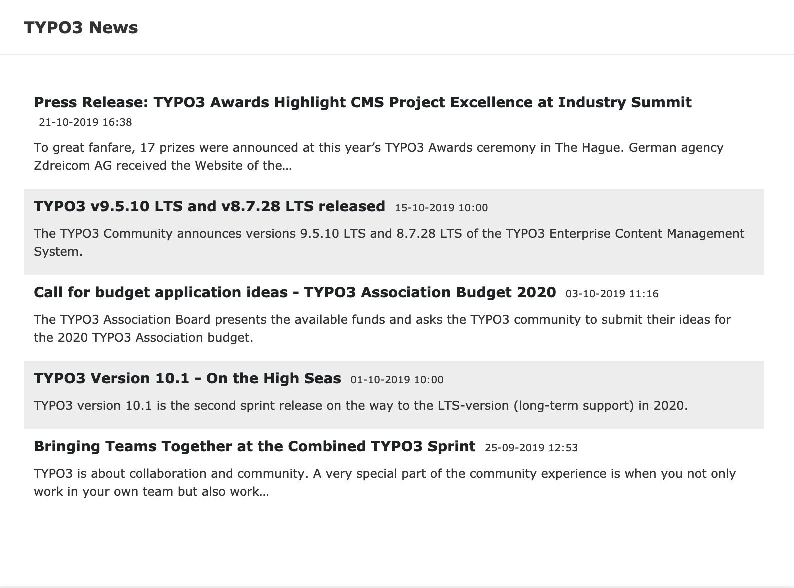
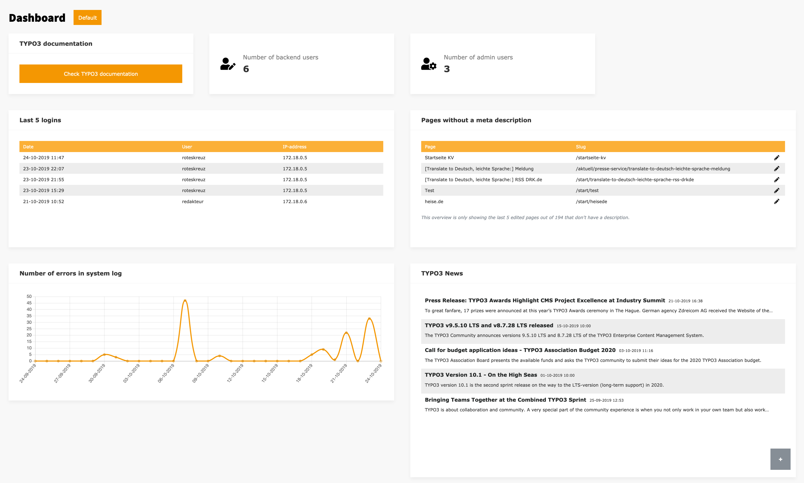

.. include:: ../Includes.txt

.. _for-editors:

===========
For Editors
===========

Target group: **Editors**

What is a widget?
=================

A widget is an element on the dashboard that displays up to date information or gives you the possibility to easily execute a command.

   Example Widget with TYPO3 News (version 1.0)

What is a dashboard?
====================

A dashboard is a collection of configured widgets.
Each user can have it's own dashboards.

Predefined Dashboards
---------------------

.. todo::

   define how editors can interact with predefined dashboards

Setup custom Dashboards
-----------------------

You can have multiple dashboards and each dashboard normally has multiple widgets.

   Example Dashboard (version 1.0)

